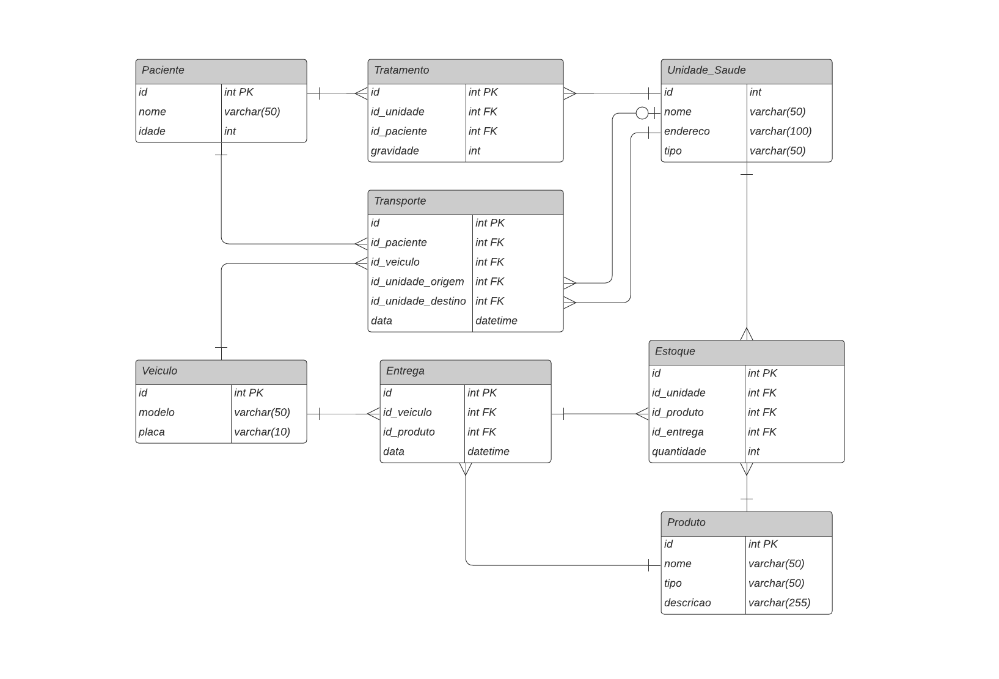
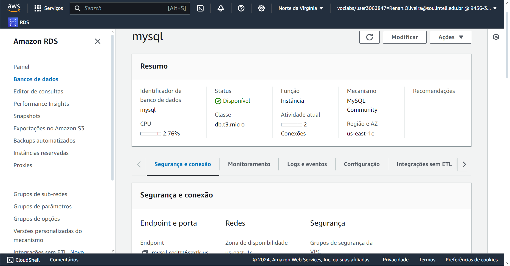
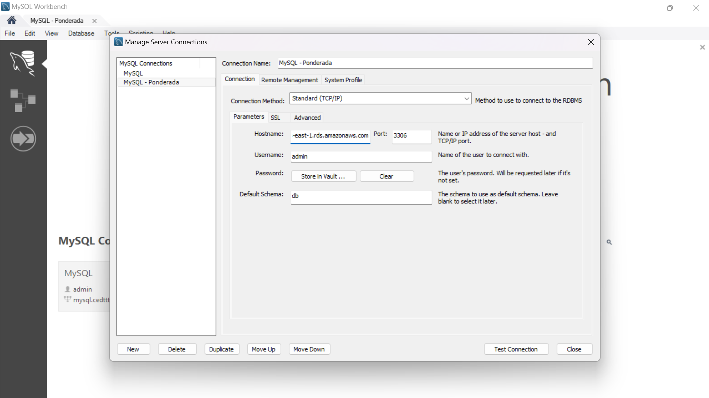
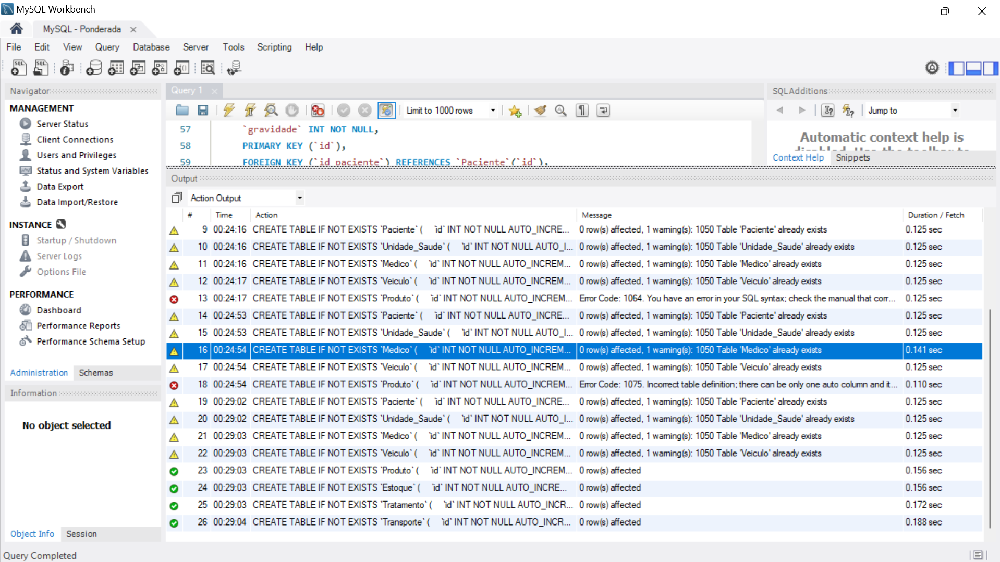
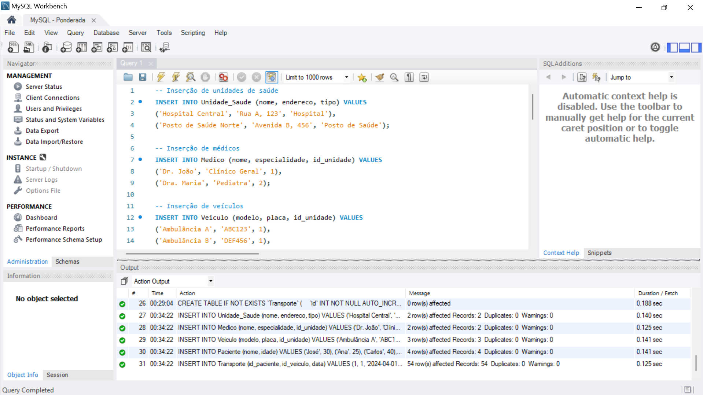
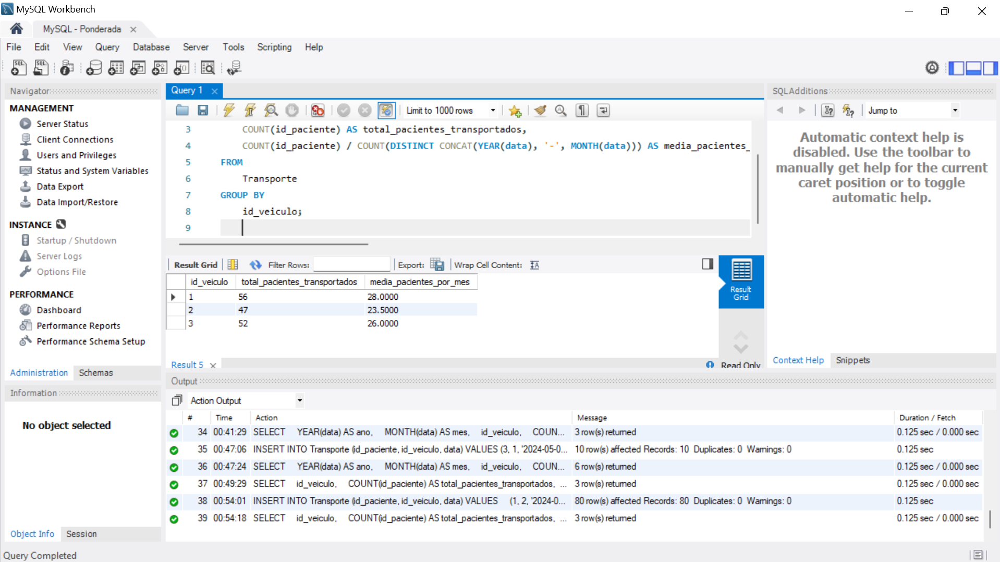

  

 

## 🎯 Objetivo
&emsp;&emsp; O objetivo deste projeto é criar um banco de dados relacional para fazer a gestão de unidades de saúde, armazenando informações sobre pacientes, médicos, consultas e exames. Para isso, é necessário realizar deploy do banco de dados na nuvem, utilizando o serviço Amazon RDS e fazer a conexão com o MySQL Workbench para povoar o database e realizar consultas SQL.

### Tecnologias Utilizadas

## 🤓 Desenvolvimento

### 📊 Diagrama Lógico

  

### 🗃️ Criar RDS

  

### 🔗 Criar Conexão com MySQL Workbench

  

### 🔎 Executar Comandos

  

  

  

 

  

